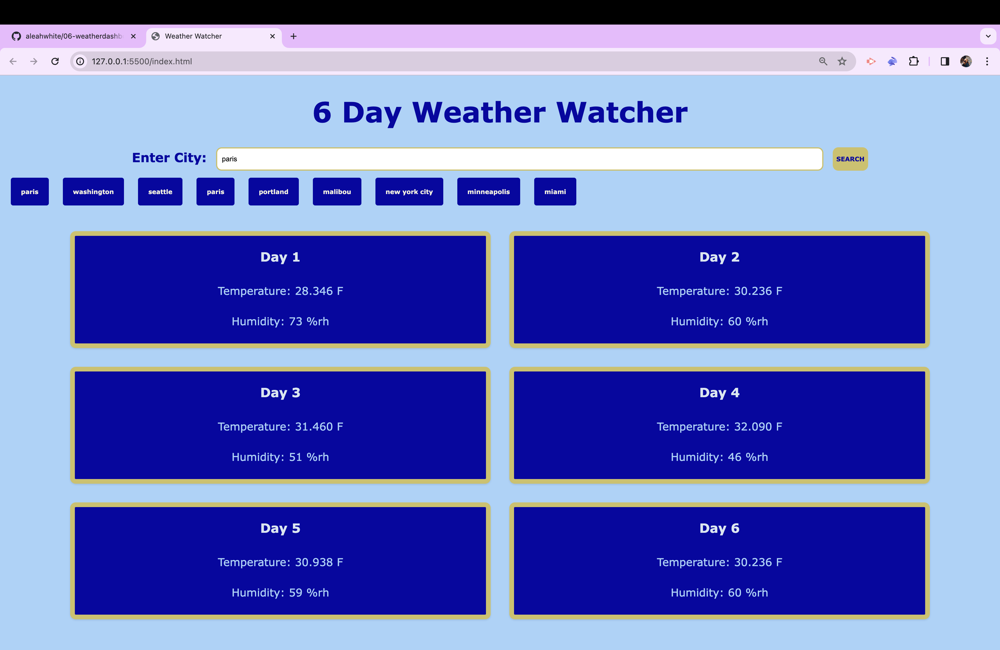

# Challenge 6 - Weather Dashboard

## Description:
This website that uses HTML, CSS, and mainly JavaScript to put together a 6 day Weather Dashboard. Using one API to fetch the coordinates of the city that you put into the search bar, then using those coordinates in another API to get the weather forecast for that place. I decided on pulling up the temperature and humidity for today and the following 5. There is a search button to use or you can hit the enter keyto search. Once you do so, six cards with the temperature, humidity, and day will be displayed. After you search you will notice buttons popping up labeled with your search, if you click those buttons you will go back to the search you recently did.

## Image and Link:

Link to deployed website: https://aleahwhite.github.io/06-weatherdashboard/ 

## Installation:
N/A

## Usage:
The use of this website is to look at any places 6 day weather forecast in seconds. Planning activities or some outfits for a trip? Well you can plan accordingly using the 6 Day Weather Dashboard to tell you the temperature and humidity of any city in the world with just a click of a button! It will also save your recent searches so you can access them easily.

## Credits:
N/A

## License:
Please refer to the MIT License in this repository!